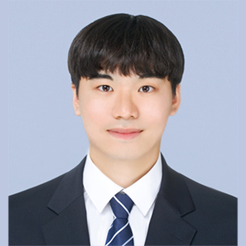
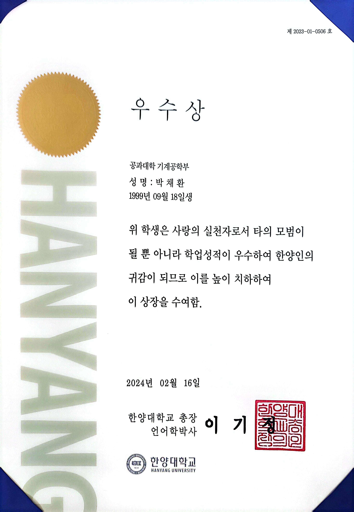
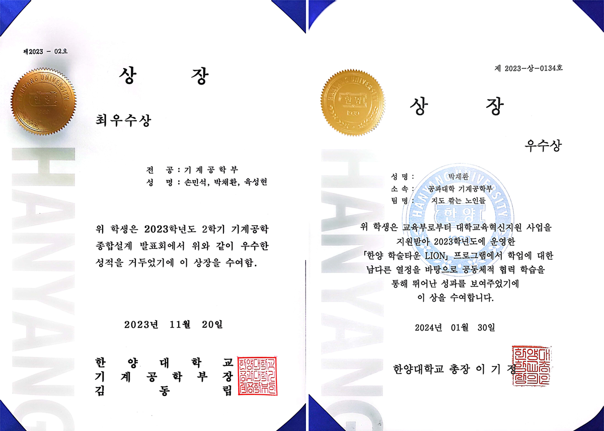
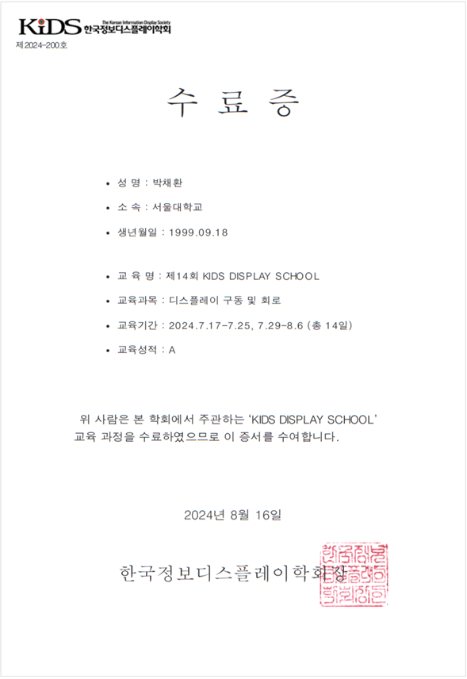
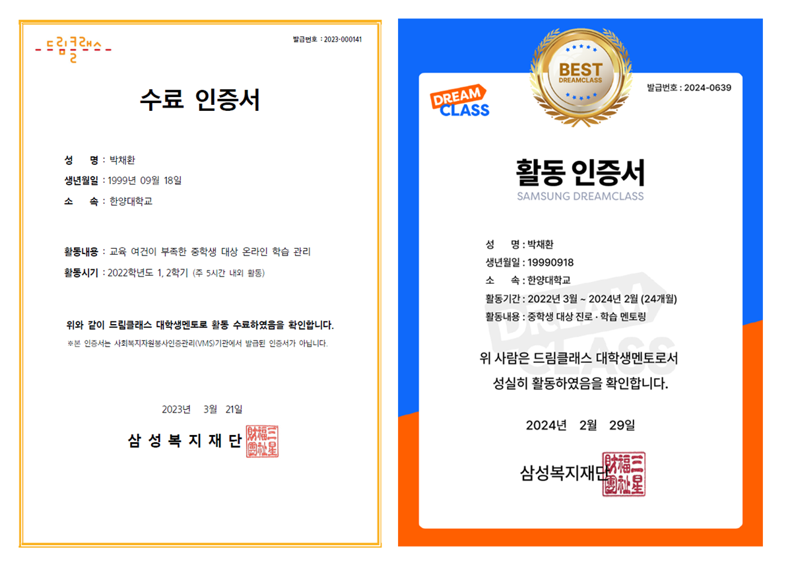
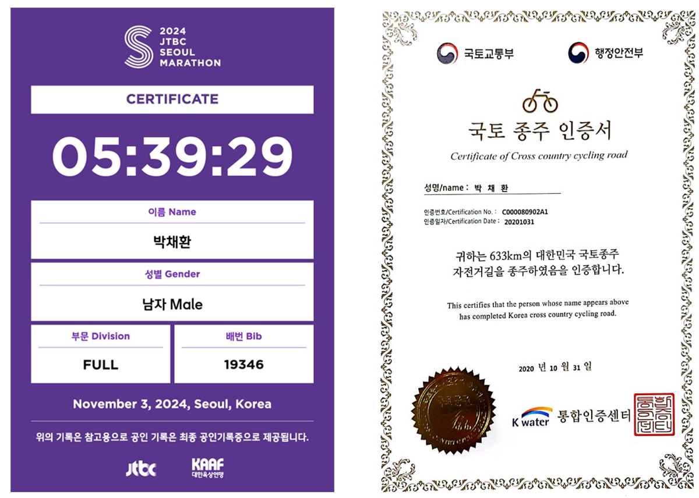
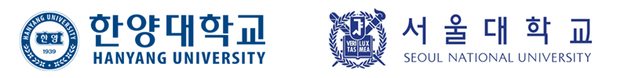

> # About Me
<html>
<head>
    <title>My Profile</title>
    <link rel="stylesheet" href="style.css">
    
</head>
<body>
    

        

            
        

        

            
<h1 style="color: #5695A8;">Chae-Hwan Park</h1>

            
<strong>B.S.</strong>&nbsp;&nbsp;ME and EE, Hanyang University

            
<strong>E-mail</strong> ordlike@snu.ac.kr

            
<strong>Research Areas</strong> CMOS/TFT Circuit Design and IOT Devices

            
<strong>Additional Info</strong> <a href="https://blog.naver.com/ordlike">Blog</a> , <a href="https://instagram.com/chae_wanny?igshid=ZDc4ODBmN[jlmNQ==">Instagram</a> , <a href="https://sites.google.com/view/snu-acelab">Laboratory</a>

            <!-- 기타 추가 정보 입력 -->
        

    

</body>
</html>

---

#### Education
- M.S. [Electrical and Computer Engineering](https://ece.snu.ac.kr/), Seoul National University, Mar 2024 -
- B.S. [Mechanical Engineering](http://me.hanyang.ac.kr/) and [Electronic Engineering](http://ee.hanyang.ac.kr/), Hanyang University, Mar 2018 - Feb 2024

***+ Relevant Coursework:*** 

<ul>
    <li>Electric Engineering (A+)</li>
    <li>Electronic Engineering(A+)</li>

    <li>Circuit Theory1 (A+)</li>
    <li>The Physics of Solid-state Electronics (A+)</li>
    
    <li>Circuit Theory2 (A+)</li>
    <li>Semiconductor Devices (A+)</li>
    
    <li>Electronic Circuit1 (A0)</li>
    <li>Semiconductor Fabrications (A+)</li>
    
    <li>Electronic Circuit2 (A+)</li>
    <li>VLSI Engineering (A0)</li>
  </ul>
---

#### Awards 
- ✔️ Hanyang Academic excellence award, Feb 2024

  

- ✔️ Hanyang Academic Town program Award, Dec 2023

- ✔️ Mechanical Engineering Design Project2 Award, Nov 2023 

  

- ✔️ Hanyang Hanyang Learning Pacemaker program Award, Jul 2023

- ✔️ LG Electronics Product Design Project Award, Jun 2023

- ✔️ Mechanical Engineering Design Project1 Award, May 2023 

- ✔️ Hanyang Academic Town program Award, Dec 2022

- ✔️ Hanyang Engineering Drone Design Award, Jun 2018 

---

#### Experiences
- ✔️ KIDS Display school : Display Backplane / Drive and Circuit, 2024 

 

- ✔️ Samsung dream class Mentoring program Completion, 2022 ~ 2024(Expected)

- ✔️ JTBC Seoul Marathon 42.195km (full-course), 2024
- ✔️ Busan-Incheon 633km Bicycle Land Run, 2020

---

#### Personal
My hobbies are playing the piano and drums! I'm very interested in music! 
 
 
(Last Update: 2025/03/03)

 
