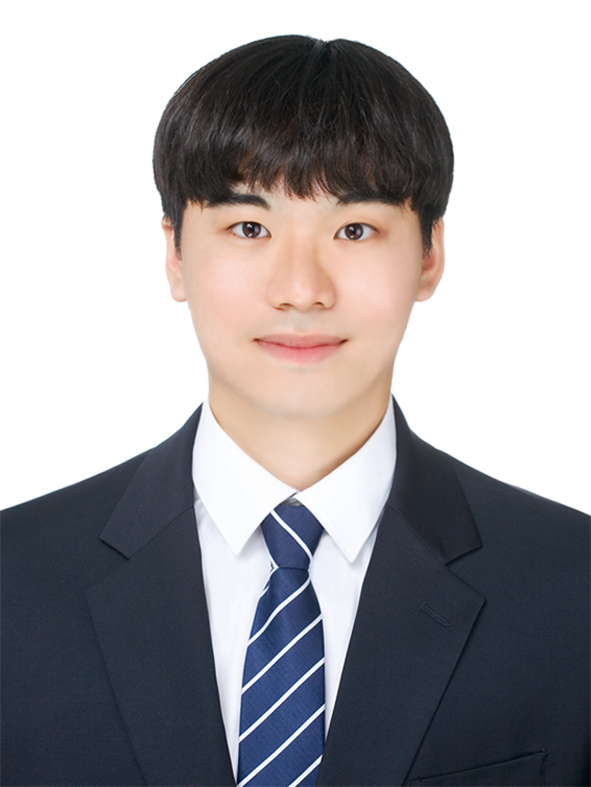
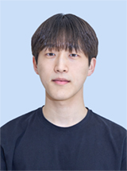

> # Chae Hwan Park
<html>
<head>
    <title>My Profile</title>
    <link rel="stylesheet" href="style.css">
</head>
<body>
    

        

            
        

        

            <h1>Your Name</h1>
            
Occupation

            
Email: your.email@example.com

            
Location: Your City, Country

            <!-- 기타 추가 정보 입력 -->
        

    

</body>
</html>

---

### Portfolio

---

#### Research Field [[Go Into LAB]](https://sites.google.com/site/seunghwalab/)

✓ Design of Materials and Structures

✓ Mechanical Reliability Test of Composites

✓ Multiscale and Modeling of Material Properties

---

#### Education
KAIST, M.S., [Graduate school of MECH](https://me.kaist.ac.kr/main/main.html), Feb 2022 - Present

HANYANG University, B.S., [Mechanical Engineering](http://me.hanyang.ac.kr/), Mar 2018 - Dec 2021

||GPA|Rank|Score|
|----|----|----|----|
|Cumulative|4.32|3/242|97.9|

---

#### Awards and Experiences
Hanyang academic best award, Mar 2021

National science and engineering scholarship, Aug 2020

Fourth industrial revolution program Completion, Jun 2020

Hanyang academic excellence award, Mar 2019

Samsung dream class Math-tutor program Completion, Jan 2019

Hanyang abroad student tutoring Dynamics-tutor program Completion, Jul 2020

Hanyang abroad student tutoring Mechanics of Materials-tutor program Completion, Mar 2021

Hanyang abroad student tutoring Thermodynamics-tutor program Completion, Mar 2021

Hanyang abroad student tutoring Fluid Mechanics-tutor program Completion, Jun 2021 

---

#### International Conference
2022, Jinwook Yeo, Sukheon Kang, Minwoo Park and Seunghwa Ryu, "Deep Learning-Based Optimization, 3D printing, and Testing of Adhesive Pillar Shape with Directionality", ENGE 2022

---

#### Domestic Conference
2023, 강석헌, 문현빈, 여진욱, 박건도, 유제천, 유승화, "Design of auxetic metamaterials for Improved low cycle fatigue life and Poisson's ratio using data-driven optimization", 2023 대한기계학회 CAE 및 응용역학부문 춘계학술대회

2023, 박건도, 이준형, 강석헌, Flavia Libonati, 유승화, "3 channel tensile test for a fast estimation of fatigue strength of composite laminates", 2023 대한기계학회 신뢰성부문 춘계학술대회

2022, 박건도, 김영수, 김민기, 송치현, 강석헌, 박진규, 유승화, "Designing staggered platelet composite structure with Gaussian process regression based Bayesian optimization", 2022 대한기계학회 CAE 및 응용역학부문 춘계학술대회

---

#### Personal
I like to sing in choir. so I'm in charge of the vice-captain of my university choir club GLEE!
 
Come visit [GLEE](https://www.youtube.com/channel/UCd3RBgdgh2xeIMHPRJBOFDw) Choir Club!

I also like to collect shoes!
 
Come visit my [Shoes Instagram](https://www.instagram.com/honey__ksh/)

★ Welcome to Secret Gallery! ★    

Come visit <a href="/secret">Enter</a>

---

<!DOCTYPE html>
<html>
<head>
    <title>Lab Members</title>
    <link rel="stylesheet" href="style.css">
</head>
<body>
    

        

            
            

                <h2 style="color: #5695A8;">Chang-jun Lee</h2>
                <strong>UG Year 3</strong>&nbsp;&nbsp;ME, Hanyang University
                 <strong>E-mail</strong> lcj3436@hanyang.ac.kr
                 <strong>Research Areas</strong> 3D CAD modeling
            

        

        <!-- 다른 멤버 정보를 이곳에 추가하세요 -->
    

</body>
</html>
