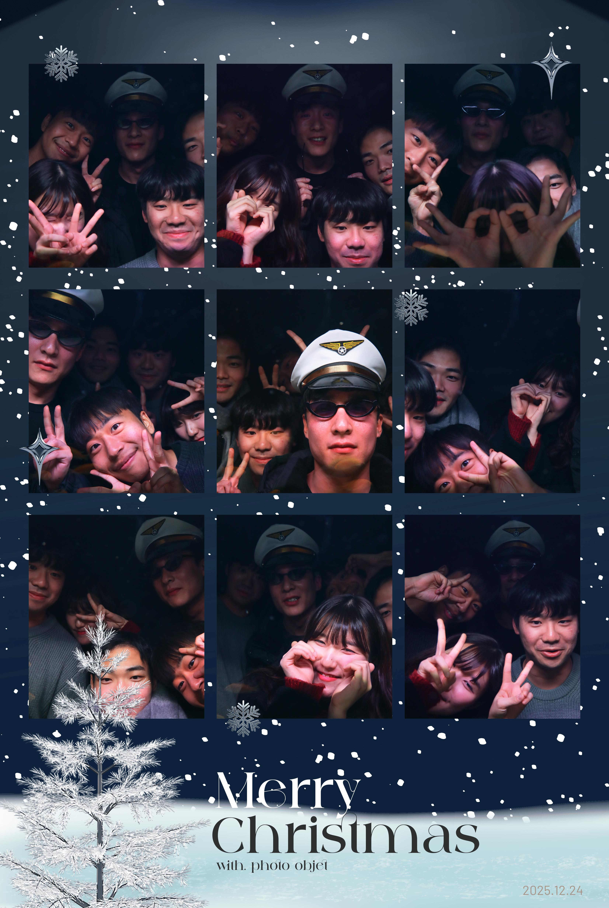
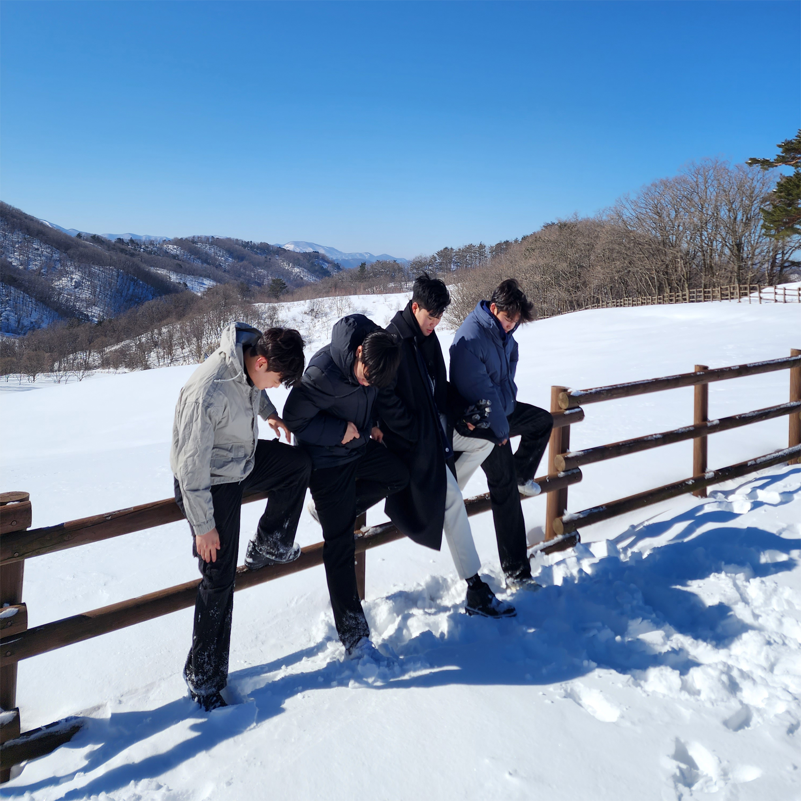
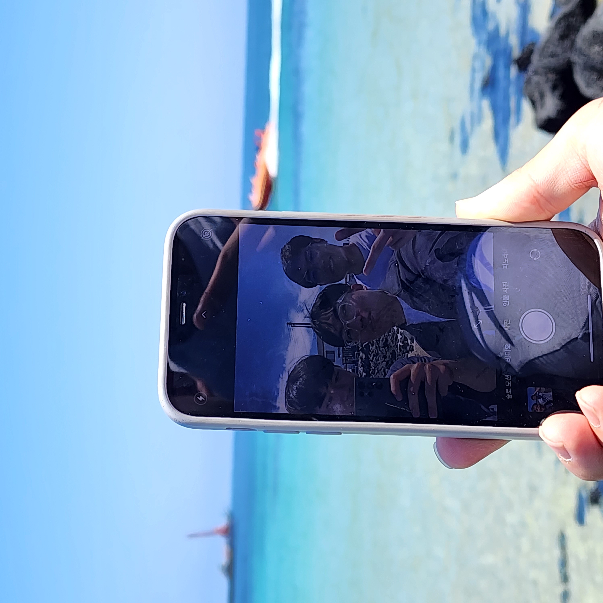
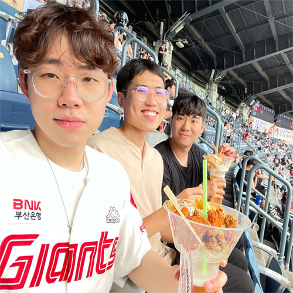
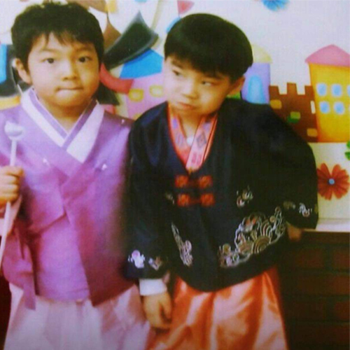

  

    <h2 class="section-label">Gallery of Memories</h2>
    

      

    

  

  <!-- ✅ grid는 딱 1번만 열기 -->
  

    

      
      
<h3>2025 Christmas eve</h3>
Lab year-end party

    

    

      
      
<h3>KMID 2025</h3>
Conference Memory

    

    

      
      
<h3>대관령여행</h3>
Feb 2024 • Winter Trip

    

    

      
      
<h3>시상식</h3>
Nov 2023 • Achievement

    

    

      
      
<h3>제주여행</h3>
Aug 2023 • Summer Vacation

    

    

      
      
<h3>속초여행</h3>
Ocean Breeze

    

    

      
      
<h3>잠실야구장</h3>
Baseball Night

    

    

      
      
<h3>어린시절</h3>
Throwback Memory

    

  

  <button class="close-btn" id="closeBtn" aria-label="Close">&times;</button>
  <button class="nav-btn nav-prev" id="prevBtn" aria-label="Previous">&#10094;</button>
  <button class="nav-btn nav-next" id="nextBtn" aria-label="Next">&#10095;</button>

  

    
    

      

      

    

  

