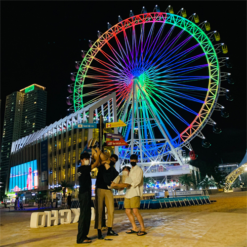
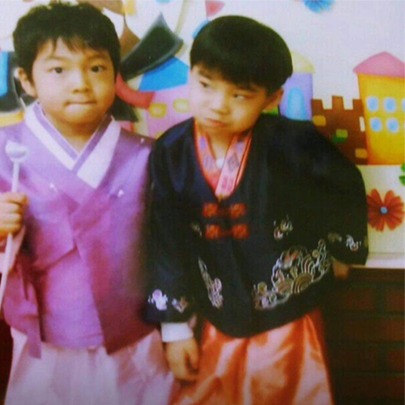

**Secret Gallery**
<!DOCTYPE html>
<html>
<head>
    <title>Gallery</title>
    <link rel="stylesheet" href="style.css"> <!-- 별도의 CSS 파일을 링크합니다 -->
    
</head>
<body>
    

        

            <a href="./../assets/new_images/team/secret/beech.jpg">
                
                

                    <h3>속초여행</h3>
                

            </a>
        

        

            <a href="./../assets/new_images/team/secret/baseball.jpg">
                
                

                    <h3>롯데 VS LG</h3>
                

            </a>
        

        

            <a href="./../assets/new_images/team/secret/youngme.jpg">
                
                

                    <h3>어린시절</h3>
                

            </a>
        

        

            <a href="./../assets/new_images/team/secret/event.jpg">
                
                

                    <h3>오잉??</h3>
                

            </a>
        

        

            <a href="./../assets/new_images/team/secret/event.jpg">
                
                

                    <h3>누구지?</h3>
                

            </a>
        

        <!-- 나머지 이미지를 동일한 방식으로 추가 -->
    

</body>
</html>
