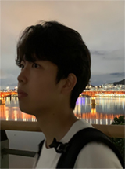

 
# | Team. EE Disign Project 
<html>
<head>
    <title>Lab Members</title>
    <link rel="stylesheet" href="style.css">
</head>
<body>
    

        

            
            

                <h2 style="color: #5695A8;">Chang-Jun Lee</h2>
                <strong>UG Year 3</strong>&nbsp;&nbsp;ME, Hanyang University
                 <strong>E-mail</strong> lcj3436@hanyang.ac.kr
                 <strong>Research Areas</strong> 3D CAD modeling
            

        

        

            
            

                <h2 style="color: #5695A8;">Dong-Hoon Oh</h2>
                <strong>UG Year 3</strong>&nbsp;&nbsp;ME, Hanyang University
                 <strong>E-mail</strong> hoon6049@hanyang.ac.kr
                 <strong>Research Areas</strong> Computer Vision 
            

        

    

     
    

        

            
            

                <h2 style="color: #5695A8;">Seung-Ju Cha</h2>
                <strong>UG Year 4</strong>&nbsp;&nbsp;ME, Hanyang University
                 <strong>E-mail</strong> chaseungju990201@gmail.com
                 <strong>Research Areas</strong> Machine learning
            

        

    

</body>
</html>
---
# | Team. ME Disign Project 
<html>
<head>
    <title>Lab Members</title>
    <link rel="stylesheet" href="style.css">
</head>
<body>
    

        

            
            

                <h2 style="color: #5695A8;">Jeong-Hoon Lee</h2>
                <strong>B.S.</strong>&nbsp;&nbsp;ME, Hanyang University
                 <strong>E-mail</strong> chjklmpwy@hanyang.ac.kr
                 <strong>Research Areas</strong> Translational Soft Devices
            

        

        

            
            

                <h2 style="color: #5695A8;">Jeong-Woo Woo</h2>
                <strong>UG Year 4</strong>&nbsp;&nbsp;ME, Hanyang University
                 <strong>E-mail</strong> korwoo1@hanyang.ac.kr
                 <strong>Research Areas</strong> Translational Soft Devices
            

        

    

     
    

        

            
            

                <h2 style="color: #5695A8;">Seung-Ju Cha</h2>
                <strong>UG Year 4</strong>&nbsp;&nbsp;ME, Hanyang University
                 <strong>E-mail</strong> chaseungju990201@gmail.com
                 <strong>Research Areas</strong> Machine learning
            

        

    

</body>
</html>
---
# | Team. Hanyang Academic Town
<html>
<head>
    <title>Lab Members</title>
    <link rel="stylesheet" href="style.css">
</head>
<body>
    

        

            
            

                <h2 style="color: #5695A8;">Seoung-Hyeon Yuk</h2>
                <strong>UG Year 4</strong>&nbsp;&nbsp;ME, Hanyang University
                 <strong>E-mail</strong> tjdgusdbr213@naver.com
                 <strong>Research Areas</strong> Semiconductor packaging
            

        

        

            
            

                <h2 style="color: #5695A8;">Eui-Hyeon Park </h2>
                <strong>UG Year 4</strong>&nbsp;&nbsp;ME, Hanyang University
                 <strong>E-mail</strong> pyh4683@hanyang.ac.kr
                 <strong>Research Areas</strong> Vehicle controls
            

        

    

     
    

        

            
            

                <h2 style="color: #5695A8;">Nyong-Nyun Nii</h2>
                <strong>UG Year 4</strong>&nbsp;&nbsp;ME, Hanyang University
                 <strong>E-mail</strong> yonghun12345687@gmail.com
                 <strong>Research Areas</strong> Robot Operating System
            

        

    

</body>
</html>
<html>
<head>
    <title>Lab Members</title>
    <link rel="stylesheet" href="style.css">
    
</head>
<body>

