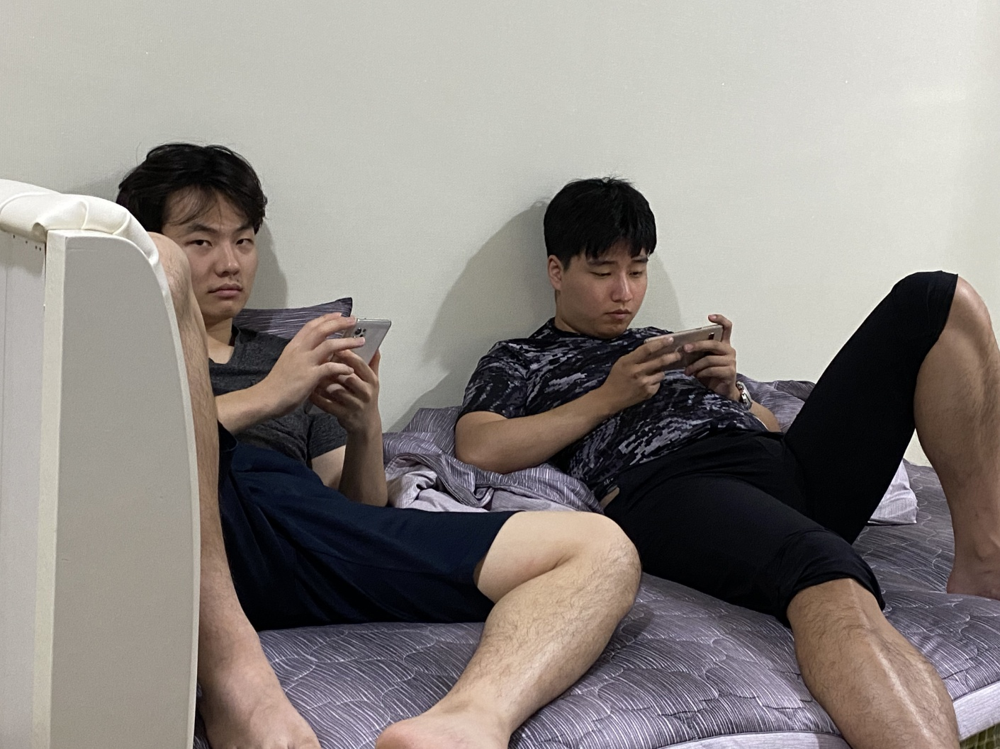

# 여름방학 모임 불참 (new)

저 한명으로 모임이 파탄나게 되어 송구 죄송할 따름입니다.^~^ 죄송한 마음을 담아 이 페이지를 생성해 보았습니다. 


```c++
#include <SPI.h>
#include <RF24.h>
#include <Servo.h>

Servo servo;      //Servo 클래스로 servo객체 생성
int value = 0;    // 각도를 조절할 변수 value
int relayPin = 2; //릴레이모듈 핀
RF24 radio(51,53);    // nRF24L01 module connections: CE pin - 51, CSN pin - 53
const byte address[6] = "00001";   // Address of the receiver

Servo Servo1;
int initialPosition1 = 80;
int finalPosition = 0;
int increment = 5;
int numReversals = 16;
//Servo Servo2;
//int initialPosition2 = 80;

void setup() {
  // 릴레이 제어 핀을 출력으로 설정
  pinMode(relayPin, OUTPUT);
  Serial.begin(9600);
  radio.begin();
  radio.openReadingPipe(1, address);
  radio.setPALevel(RF24_PA_LOW);
  radio.startListening();
  servo.attach(3);
  //Servo1.attach(3);  // Attach servo to pin 9
  //Servo1.write(initialPosition1);  // Set initial position to 0 degrees
  //Servo2.attach(5);  // Attach servo to pin 9
  //Servo2.write(initialPosition2);  // Set initial position to 0 degrees
  //delay(1000);  // Wait for the servo to reach the initial position
}
int n = 0;
void loop() {
  if (radio.available()) {
    
    int pressureValue;
    radio.read(&pressureValue, sizeof(pressureValue)+n);   // Read pressure value
    //Serial.print("Received Pressure: ");
    Serial.println(pressureValue);
    
    if( pressureValue%30 == 15 ){
      value = 0;
      servo.write(value); //value값의 각도로 회전. 
      digitalWrite(relayPin, HIGH);
      n=n+1;
    }
   

    else if(pressureValue%30 ==0 ){
      //value = 80;
      //servo.write(value);
      //delay(500);
      //value = 180;
      //servo.write(value);
      
      
      value = 80;
      servo.write(value);
      delay(1080);
      digitalWrite(relayPin, LOW);
          
  //}
  // Reverse the rotation 9 times in 10-degree increments
  //for (int i = 0; i < numReversals; i++) {
       
  //}


    }
  
    // Perform desired actions with the pressure value received
  }
  }

```


